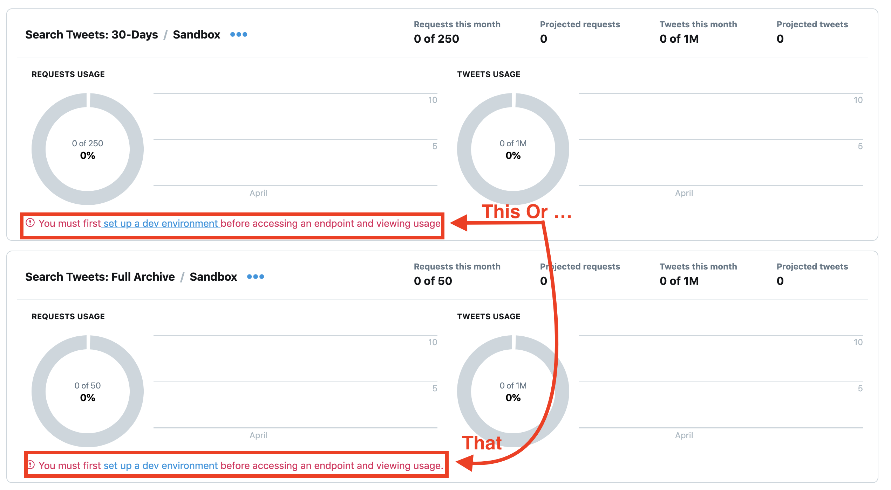
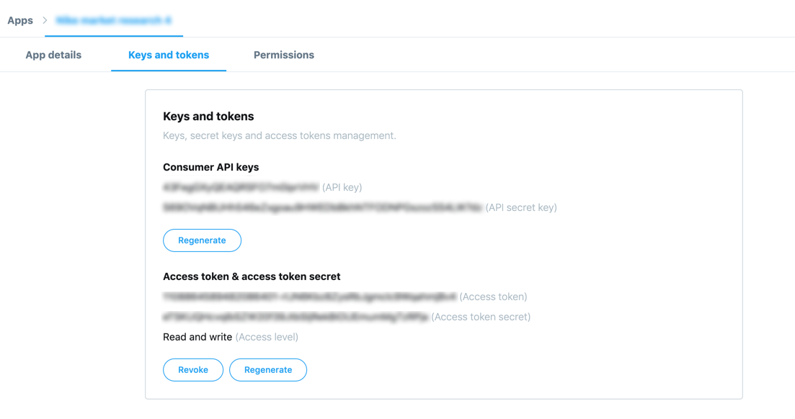

**Table of Contents**
---

- [Description](#description)
- [For those who have never used Twitter's API](#for-those-who-have-never-used-twitters-api)
  - [Dev environment](#dev-environment)
  - [Consumer API keys](#consumer-api-keys)
- [Required set up](#required-set-up)
- [Available Scripts](#available-scripts)
- [Running in the background](#running-in-the-background)


# Description

> This tweet collector comes with a cron job included. See `yarn start` for more details

The purpose for this repository was to create a custom tweets collector for a class project that deals with analyzing text. 

# For those who have never used Twitter's API

In order to use this code you will need to get a developer account approved by Twitter. [Go to this link](https://developer.twitter.com/) and a sign up for one.

## Dev environment
Once you have done that you will then need to create an environment. If your account has been validated you should be able to see a screen like this:



You can select whichever environment you want according to your needs. You will then fill a small form asking you for a label, this label is important and we'll refer to it as **`ENV`**. 

## Consumer API keys

Along with your developer account you will be granted 2 important strings of text: a `CONSUMER_KEY` and a `CONSUMER_SECRET`, referred to as API key and API secret key respectively on your developer dashboard. You will find them in a screen like this:




# Required set up

- Fire up a terminal and move inside this project. To install the dependencies needed for this program to work run **`npm install`**
- Create a file named **`.env`** and add the following with your information:
```sh
# Your auth information, copy as is and don't surround with quotations and dont put any spaces
CONSUMER_KEY=(fill this with yours)
CONSUMER_SECRET=(fill this with yours)
ACCESS_TOKEN=(fill this with yours)
ACCESS_TOKEN_SECRET=(fill this with yours)
# The endpoint specified by Twitters API to fetch tweets from
TWITTER_SEARCH_URL=api.twitter.com/1.1/tweets/search/fullarchive/
# Your environment label
ENV=test
# This is where your data gets saved. Must end with ".json"
DATA_DIR=...
# This is the query you want to run every time you run the collector
QUERY='#nike lang:en' 
```
Fill the fields with your account's details. You can also change the `TWITTER_SEARCH_URL` to use the `30day` instead of `fullarchive` by switching that small section at the end of the url.

After this you can proceed with the next section.

# Available Scripts

:warning: make sure you go over the previous set up section before running any of these scripts.

**`yarn collect`** — Collects 100 tweets and saves them to a file named according to what you assigned `DATA_DIR` to be in your `.env` file. The query is hardcoded in the `.env` file.

**`yarn start`** — Starts a cron job for collecting tweets every 15 seconds. :warning: You must have all filled all the variables in the `.env` file you created.

# Running in the background

If you would like to run this in the background install [pm2](https://www.npmjs.com/package/pm2) and run the following command:

**`pm2 start npm -- start --name "<whatever you want to call it>"`**